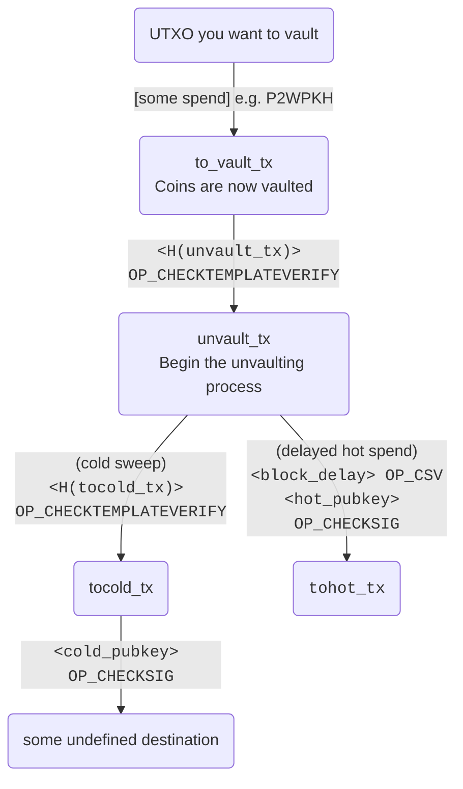

# Op_SecureTheSandwich: A CTV Vault RPG


## Overview

Can you stop the evil cat thief from eating the Reuben sandwich before it's too late?! 🥪🐱

## Requirements

- Rust
- Bitcoin Inquisition node https://github.com/bitcoin-inquisition/bitcoin

## Commands

To start the game, run the following commands

Start a bitcoin inquisition node in regtest (i had to add fallback fee for now to get it to work)
```bash
./bitcoind -regtest -fallbackfee=0.0001
```

```bash
cargo run
```

## Example

```bash
➜  Op_SecureTheSandwich git:(main) cargo run
    Finished `dev` profile [unoptimized + debuginfo] target(s) in 0.03s
     Running `target/debug/Op_SecureTheSandwich`
Wallet loaded successfully.
🥶 basement fridge address: bcrt1qlay8zlqhrsly9u0q9mmnlfjmrvccp9f3j0jehz
🧊 kitchen fridge (CTV Vault Address: bcrt1pm6wlh2m0cmztr07nurwm6emuv8u0hann2md3jc9a40rjnp3m4trqea3w3q)
🍴 Kitchen (CTV Unvault Address: bcrt1p32dh4uqmy7qcvssvja5pmeyenu327fvyn5nks7908egux9376pnqfemal3)

😋 You start making a delicious reuben sandwich...! You look forward to eating it later, but hope your evil cat doesnt try to steal it first
(Mining 101 blocks to funding address: bcrt1qv6zu4ectzyq4zneqhra4sxssceqcmxsw7gdk4v)

🥪 You place the reuben sandwich in the kitchen fridge
(Funding transaction sent:
091a599788a3a6d1bbe42de1a527372b148db6e5453e92ce0046b24a2c77640c)

 Press Enter to continue...

⌛ Some more time passes... (Mining 1 block)

🚨 Someone took the reuben sandwich out of the fridge!! or something...😹
(Transaction from vault sent to unvault address:
TXID 279bc3c4279e9edd130722ade1e85f0e0b7d518beff7d178852f97daa06c91df)

 Press Enter to continue...

🕗 Even more time passes... (Mining 1 block)

📲 Your super smart fridge texts you the following alert: Your delicious reuben sandwich has been taken from the fridge and moved in to the kitchen!
(TXID
279bc3c4279e9edd130722ade1e85f0e0b7d518beff7d178852f97daa06c91df FOUND IN MEMPOOL!!)

 Press Enter to continue...


What do you want to do? (enter a number between 1 and 3)

1: Run to the kitchen to rescue the reuben sandwich and take it to the really cold fridge in your basement (sweep funds to cold storage address)
2: Put the sandwich in the toaster and wait for it to heat up (sweep funds to hot wallet address)
3:😹 You are the evil cat thief so you want to take the sandwich for yourself (sweep funds to theifs address)
1

🏃 You make a run for the kitchen to investigate!!

 Press Enter to continue...


⏳ The evil cat tried to eat the sandwich but it's not ready to eat yet!!!
(hot wallet spend path failed as 100 blocks have not passed): Err(JsonRpc(Rpc(RpcError { code: -26
message: "non-BIP68-final", data: None })))

Choose an option below:
1: Put the sandwich in the really cold fridge in your basement so you can eat it later (sweep funds to cold storage address)
2:😹 You are the evil cat thief so you want to take the sandwich home to your own fridge and eat it later (try and sweep funds to a different cold storage address)
1

❄️ You put the sandwich in the really cold fridge in your basement so you can eat it later.
You think to yourself that its really amazing how i can secure this sandwich so easily
and not have to worry about backing up any crazy weird stuff to recreat the sandwich.
You also think to yourself that it was a weird thing to think about (Transaction from vault
to cold storage sent: ff2f76c9f144ea2b6f8220645ccb2a2c0a8b6f6d8696dfcb9b8ceffb95a581d7)
```

## Tech stuff

This is a reimplentation of jamesob's `simple-ctv-vault`. You can read more here https://github.com/jamesob/simple-ctv-vault





The ctv hash script i used is from here https://github.com/bennyhodl/dlcat


### TODO:

fees are hard coded for now so i need figure out how to add ephemeral anchors https://bitcoinops.org/en/topics/ephemeral-anchors/
